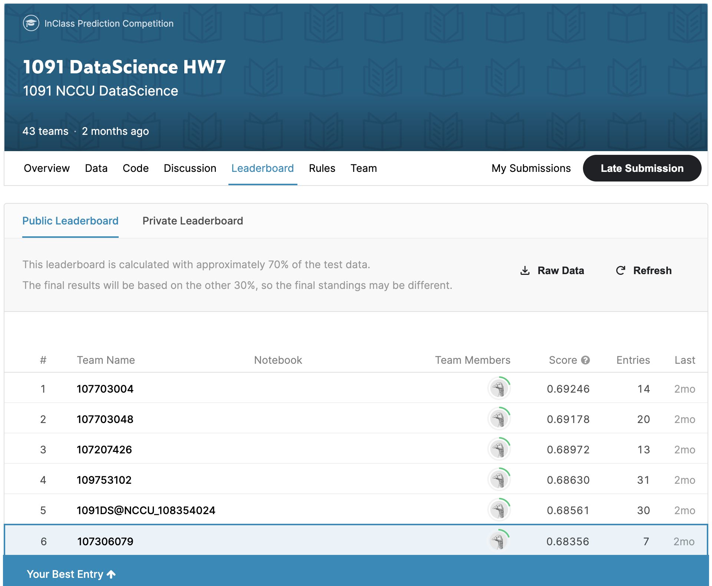

# hw7: in-class kaggle competition

You need to develop a binary classifier to predict good loan or bad loan based on 20 features of costumers. The training data is used to train your model. Then, you submit your prediction result by applying the trained model on testing data.

Got 6th place in the competition. 
